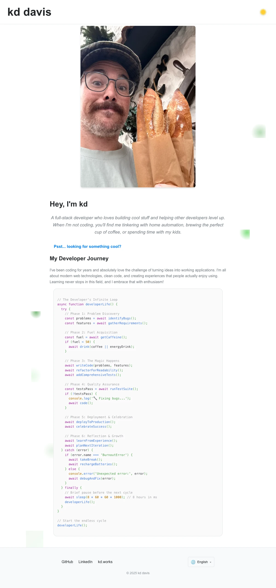
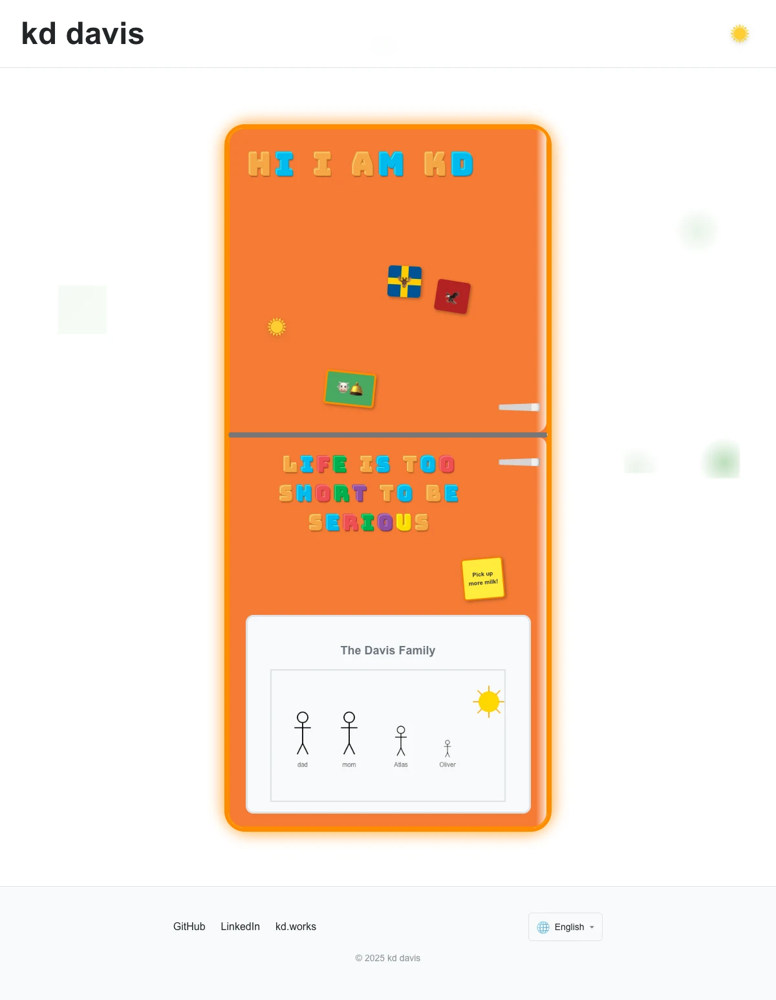
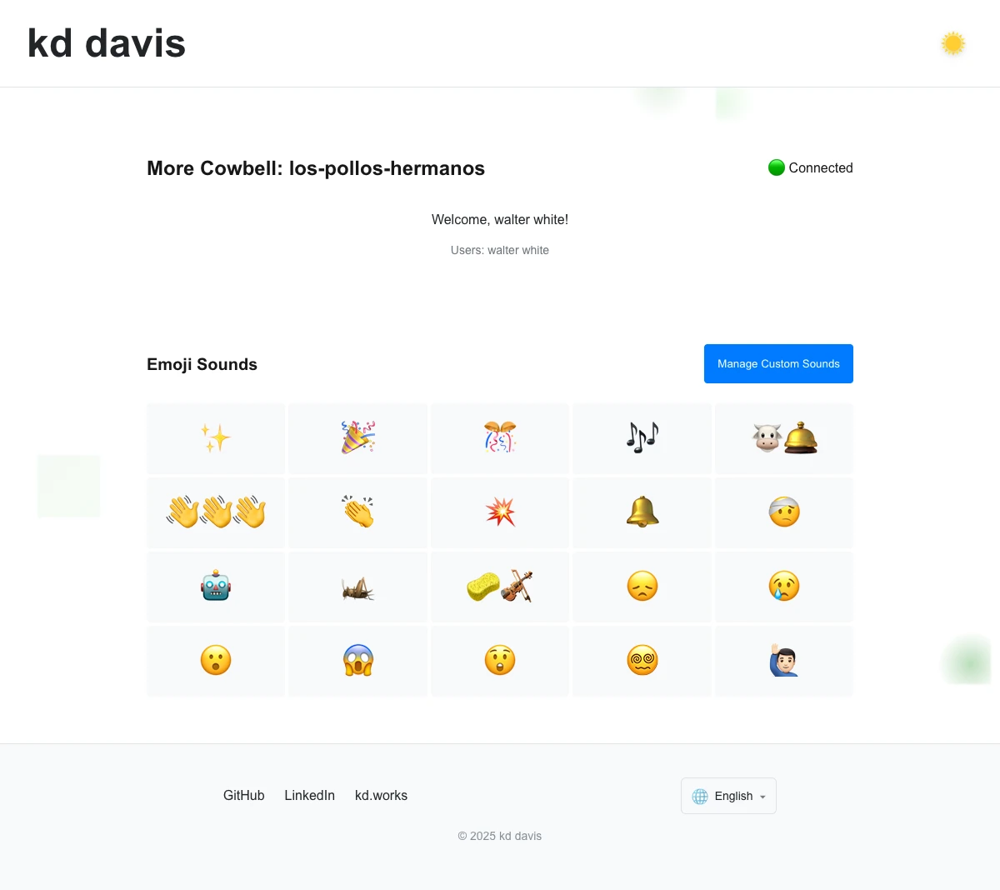

# kd.works

A creative portfolio website built with React, TypeScript, and running with Vite. Includes a fun little fridge with some easter eggs and a real-time collaborative sound board

[](https://app.netlify.com/projects/kds-fridge/deploys)

## Features

- **Fridge Portfolio**: Interactive fridge-themed portfolio with little easter eggs
- **More Cowbell App**: Real-time collaborative sound board for rooms
- **Dark Mode**: Toggle between light and dark themes
- **Internationalization**: Support for multiple languages
- **Responsive Design**: Works on desktop and mobile devices

## Screenshots

### Homepage


The main portfolio page featuring an introduction, developer journey, and navigation to other sections.

### Fridge Portfolio


Interactive fridge-themed contact page with magnetic notes, contact form, and family whiteboard.

### More Cowbell Sound Board


Real-time collaborative emoji sound board where users can join rooms and play sounds together.

## Tech Stack

- **Frontend**: Vite, React, TypeScript, React Router
- **Styling**: CSS modules
- **Real-time**: PartyKit

## Getting Started

First, install dependencies:

```bash
npm install
```

Then, run the development server:

```bash
npm run dev
```

Open [http://localhost:3000](http://localhost:3000) with your browser to see the result.

## Screenshots

To update screenshots for social media sharing:

```bash
npm run screenshots
```

This will start the dev server if needed, capture screenshots of all pages, and update the social media preview images.

## PartyKit Setup

For the real-time features, start the PartyKit server alongside the Vite dev server:

```bash
npm run partykit
```

This runs the PartyKit development server on port 54300.

## Learn More

- [Vite Documentation](https://vitejs.dev/)
- [PartyKit Documentation](https://docs.partykit.io)
- [React Router Documentation](https://reactrouter.com/home)
